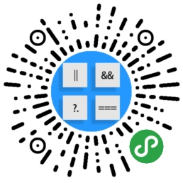

# Introduction

这个是我的个人博客

for 知其所以然

目录： [link start](https://github.com/jingchenxu/jingchenxu-s-blog/tree/3105bf781ba8996d9e379cd278e4c506cc78b117/SUMMARY.md)

博客地址：[https://myblog.deepwater.tech](https://myblog.deepwater.tech)

**学习计划**

springboot: [https://qbgbook.gitbooks.io/spring-boot-reference-guide-zh/content/](https://qbgbook.gitbooks.io/spring-boot-reference-guide-zh/content/)

技术栈

* [x] **springboot**
* [x] vue
* [x] flutter
* [ ] swiftUI
* [x] react
* [x] \*\*\*\*[**fabric.js**](https://github.com/fabricjs/fabric.js)\*\*\*\*

**我的应用**

> Rosa 一款通过解析PDM通过模板生成代码的桌面应用，下载地址：[https://github.com/jingchenxu/rosa-powerdesigner/releases](rosa-xiang-mu-xiang-guan/)

> 一个程序员刷题小程序

