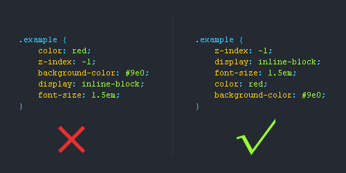
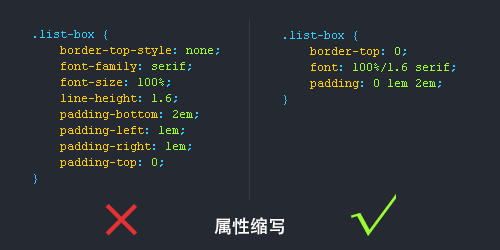

# css 样式书写规范

## css书写顺序

1. 位置属性（position,top,right,z-index,display,float等）
2. 大小（width,height,padding,margin）
3. 文字系列（font,line-height,letter-sapcing,color-text-align等）
4. 背景（background,border等）
5. 其他（animation,transition等）

## css书写规范使用css缩写属性

CSS有些属性是可以缩写的，比如padding,margin,font等等，这样精简代码同时又能提高用户的阅读体验。

去掉小数点前的“0”

简写命名

很多用户都喜欢简写类名，但前提是要让人看懂你的命名才能简写哦!

16进制颜色代码缩写

有些颜色代码是可以缩写的，我们就尽量缩写吧，提高用户体验为主。

连字符CSS选择器命名规范

1.长名称或词组可以使用中横线来为选择器命名。

2.不建议使用“\_”下划线来命名CSS选择器，为什么呢?

输入的时候少按一个shift键;

浏览器兼容问题 \(比如使用\_tips的选择器命名，在IE6是无效的\)

能良好区分JavaScript变量命名\(JS变量命名是用“\_”\)

不要随意使用Id

id在JS是唯一的，不能多次使用，而使用class类选择器却可以重复使用，另外id的优先级优先与class，所以id应该按需使用，而不能滥用。　

为选择器添加状态前缀

有时候可以给选择器添加一个表示状态的前缀，让语义更明了，比如下图是添加了“.is-”前缀。  

**CSS命名规范\(规则\)常用的CSS命名规则**

头：header

内容：content/container

尾：footer

导航：nav

侧栏：sidebar

栏目：column

页面外围控制整体佈局宽度：wrapper

左右中：left right center

登录条：loginbar

标志：logo

广告：banner

页面主体：main

热点：hot

新闻：news

下载：download

子导航：subnav

菜单：menu

子菜单：submenu

搜索：search

友情链接：friendlink

页脚：footer

版权：copyright

滚动：scroll

内容：content

标签：tags

文章列表：list

提示信息：msg

小技巧：tips

栏目标题：title

加入：joinus

指南：guide

服务：service

注册：regsiter

状态：status

投票：vote

合作伙伴：partner

**注释的写法:**

　　/\* Header \*/

　　内容区

　　/\* End Header \*/

**Id的命名:**

　　1\)页面结构

　　容器: container

　　页头：header

　　内容：content/container

　　页面主体：main

　　页尾：footer

　　导航：nav

　　侧栏：sidebar

　　栏目：column

　　页面外围控制整体佈局宽度：wrapper

　　左右中：left right center

**\(2\)导航**

　　导航：nav

　　主导航：mainnav

　　子导航：subnav

　　顶导航：topnav

　　边导航：sidebar

　　左导航：leftsidebar

　　右导航：rightsidebar

　　菜单：menu

　　子菜单：submenu

　　标题: title

　　摘要: summary

**\(3\)功能**

　　标志：logo

　　广告：banner

　　登陆：login

　　登录条：loginbar

　　注册：register

　　搜索：search

　　功能区：shop

　　标题：title

　　加入：joinus

　　状态：status

　　按钮：btn

　　滚动：scroll

　　标籤页：tab

　　文章列表：list

　　提示信息：msg

　　当前的: current

　　小技巧：tips

　　图标: icon

　　注释：note

　　指南：guild

　　服务：service

　　热点：hot

　　新闻：news

　　下载：download

　　投票：vote

　　合作伙伴：partner

　　友情链接：link

　　版权：copyright

**注意事项::**

　　1.一律小写;

　　2.尽量用英文;

　　3.不加中槓和下划线;

　　4.尽量不缩写，除非一看就明白的单词。

**CSS样式表文件命名**

　　主要的 master.css

　　模块 module.css

　　基本共用 base.css

　　布局、版面 layout.css

　　主题 themes.css

　　专栏 columns.css

　　文字 font.css

　　表单 forms.css

　　补丁 mend.css

　　打印 print.css

