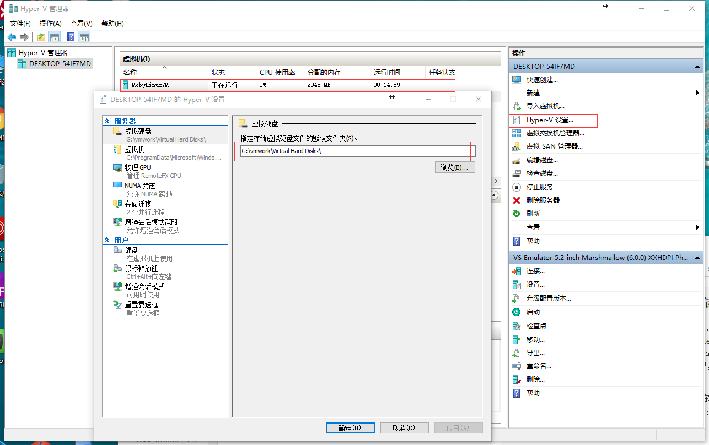

# Docker 学习记录

自从安装了docker以后，突然发现自己的C盘越来越小了，朕甚为担忧，所以想着找找解决办法，以下为解决办法，在win10下docker是以Hyper-V作为虚拟机的，每次启动docker，docker都会在Hyper-V中创建一个虚拟机，该虚拟机加载对应的虚拟磁盘，我看了一下虚拟磁盘的位置，我擦在C盘已经都快有8G了，难怪C盘最近缩水的厉害。

在win10下的搜索框搜索Hyper-V,打开Hyper-V 管理机，你会看到一个叫MobyLinuxMV的虚拟机，选中该虚拟机，点击Hyper-V 设置，看到以下界面：

