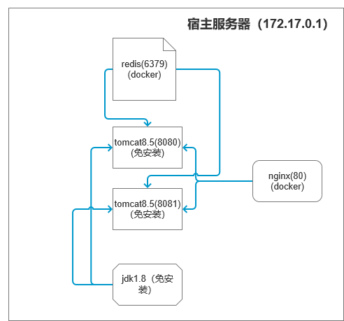

# docker  安装nginx并反向代理主机tomcat

> 最近要部署一个电商的服务器环境，主要涉及到的tomcat、nginx、redis的部署，我个人不是喜欢什么都往服务器上装，有些软件难以卸载干净，安装或是升级都会或多或少的残留一些东西，时间长了服务器会被一些不知道的东西占用资源。

## 服务器部署示意图



## docker 安装nginx

1. 拉取官方镜像

```bash
docker pull nginx
```

1. 运行容器

```bash
docker run -p 80:80 --name nginx -d nginx
```

1. 将容器内部的配置文件复制到宿主机

```bash
docker cp -a nginx:/etc/nginx/ /srv/nginx/conf
```

1. 停止容器并删除

```bash
docker stop nginx
docker rm nginx
```

1. 重新运行容器，挂载在第三部中复制出的配置文件

```bash
docker run -p 80:80 --restart always --name nginx -v /srv/nginx/www:/www -v /srv/nginx/conf/:/etc/nginx/ -v /srv/nginx/logs:/var/log/nginx -v /srv/nginx/wwwlogs:/wwwlogs -d nginx
```

1. 重启容器

```bash
docker restart nginx
```

1. 查看在docker虚拟网络中配置的ip

```bash
docker inspect containerid
```

此时我们可以看到宿主机在docker虚拟网络内的ip为： `172.17.0.1` 编辑 /conf/conf.d/default.conf 文件，配置如下：

```text
upstream projectname {
  server 172.17.0.1:8080;
  server 172.17.0.1:8081;
}
server {
    listen       80;
    server_name  www.xxx.com;

    #charset koi8-r;
    access_log  /var/log/nginx/host.access.log  main;

    location / {
        proxy_set_header  Host  $http_host;
        proxy_set_header  X-Real-IP  $remote_addr;
        proxy_set_header  X-Forwarded-For $proxy_add_x_forwarded_for;
        proxy_pass  http://projectname;
        rewrite "^/+$" /smoec/index.html redirect;
        root /smoec/;

    }

    error_page   500 502 503 504  /50x.html;
    location = /50x.html {
        root   /usr/share/nginx/html;
    }
}
```

## docker 安装redis

docker 安装redis的方式比较简单，执行以下的命令就可以安装了：

```bash
docker run -d -p 6379:6379 --name myredis registry.docker-cn.com/library/redis
```

通过以上的推测，我们可以知道，服务器的主机在docker的虚拟网络中的ip为 `172.17.0.3` 所以redis的访问地址为： `172.17.0.1:6379`

## tomcat 配置负载均衡

这里使用 [redisson](https://github.com/redisson/redisson)用于负载均衡，使用此方式进行负载均衡配置，只需要添加3个文件，以及修改context.xml文件：

这里我使用的是tomcat8.5,则下载对应的jar包，[下载地址](https://github.com/redisson/redisson/tree/master/redisson-tomcat)需要下载redisson-all、redisson-tomcat-8 这2个jar包添加到tomcat的lib包下。

修改context.xml需要在文件的根目录下添加如下内容：

```markup
    <Manager className="org.redisson.tomcat.RedissonSessionManager"
          configPath="${catalina.base}/conf/mySession.json" readMode="REDIS" updateMode="DEFAULT"/>
```

需要创建mySession.json文件，文件内容如下：

```javascript
{
  "singleServerConfig":{
     "idleConnectionTimeout":10000,
     "pingTimeout":1000,
     "connectTimeout":10000,
     "timeout":3000,
     "retryAttempts":3,
     "retryInterval":1500,
     "reconnectionTimeout":3000,
     "failedAttempts":3,
     "subscriptionsPerConnection":5,
     "clientName":null,
     "address": "redis://172.18.0.3:6379",
     "subscriptionConnectionMinimumIdleSize":1,
     "subscriptionConnectionPoolSize":50,
     "connectionMinimumIdleSize":32,
     "connectionPoolSize":64,
     "database":0
  },
  "threads":0,
  "nettyThreads":0,
  "codec":{
     "class":"org.redisson.codec.JsonJacksonCodec"
  },
  "transportMode":"NIO"
}
```

该文件需要防止到tomcat的conf文件夹下，注意文件中的address即为redis的地址。

