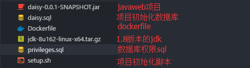

# web 项目容器化

* 前言

> 其实我是一直有这样的需求就是本地的开发环境与生产环境保持高度一致，但是保持高度一致是件很困难的事情，我们正常的开发环境都是Windows，但是生产环境常常回事linux，很多时候我们本地好好的代码到服务器上就跑不起来呢？想过打包本地的开发环境到生产环境，我想这么迫切的需求市面上一定有对应的解决方案，果然我找到了docker。

* 准备

我这里以javaweb项目为例，一个javaweb项目需要哪些配置呢，大致需要以下的配置：服务器环境（linux）、JDK、mysql，这里我是以springboot项目为例的，我们继续分解一下，我们需要什么我们需要一个linux环境，该环境装有1.8版本的JDK,装有5.7版本的mysql，容器在第一次启动的时候将初始化数据库，在数据库初始化完成后，将启动你的javaweb项目。

下面是最根本的，你需要在你的本地安装一下docker软件，不然怎么制作docker镜像呢！

下面是需要准备的文件，文件的目录如下：



发布一个打包为jar的javaweb 项目需要准备额就是以上的原料。

* 创建发布镜像

在上图中我们可以看到一个dockerfile文件，该文件是创建docker镜像的基础，dockerfile可以说是一个配置文件，改配置文件中说明了这个镜像的各个配置项我们可以大致的参观下：

```text
# 版本信息
FROM mysql:5.7
MAINTAINER daisy "jingchenxu2015@gmail.com"

# 创建与daisy相关的文件夹
RUN mkdir /daisy

# 设置mysql免密码登录
ENV MYSQL-ALLOW_EMPTY_PASSWORD yes

# 初始化mysql
COPY setup.sh /daisy/setup.sh
COPY daisy.sql /daisy/daisy.sql
COPY privileges.sql /daisy/privileges.sql
#CMD ["sh", "/daisy/setup.sh"]

# 安装jdk环境 这里会自动解压安装包
ADD jdk-8u162-linux-x64.tar.gz /daisy/
ENV JAVA_HOME=/daisy/jdk1.8.0_162
ENV PATH $PATH:$JAVA_HOME/bin

# 对外暴露端口号
EXPOSE 4000

# 启动daisy
ADD /daisy-0.0.1-SNAPSHOT.jar //
#ENTRYPOINT ["java", "-jar", "/daisy-0.0.1-SNAPSHOT.jar"]
ENTRYPOINT ["sh", "/daisy/setup.sh"]
```

系统的初始化主要使用`setup.sh`这个脚本来初始化的，该脚本在镜像制作进行的过程中不会执行，而是在容器启动的时候执行，而dockerfile文件中指定的操作是在镜像创建过程中执行的。

准备好daisy.sql和privileges.sql数据库初始化文件，daisy.sql主要是数据库表结构和一些配置参数，privileges主要是数据库的用户权限信息。

接下来需要注意的是`setup.sh`脚本,该bash脚本用于初始化系统，可以参考如下：

```bash
#!/bin/bash
set -e

#查看mysql服务的状态，方便调试，这条语句可以删除
echo `service mysql status`

echo '1.启动mysql....'
#启动mysql

service mysql start
sleep 20

echo `service mysql status`

echo '2.开始导入数据....'
#导入数据
mysql < /daisy/daisy.sql
echo '3.导入数据完毕....'

sleep 3
echo `service mysql status`

#重新设置mysql密码
echo '4.开始修改密码....'
mysql < /daisy/privileges.sql
echo '5.修改密码完毕....'

#sleep 3
echo `service mysql status`
echo `mysql容器启动完毕,且数据导入成功`

java -jar /daisy-0.0.1-SNAPSHOT.jar

tail -f /dev/null
```

* 镜像发布流程
* 将所有准备文件放置到同一根目录下；
* 在确认docker软件启动后,在根目录下打开命令行运行以下命令：

  ```bash
  docker build -t daisy:latest .
  ```

* 在命令运行完成后，查看镜像是否生成：

  ```bash
  docker images
  ```

* 在确认镜像生成后，创建容器并运行：

  ```bash
  docker run --name daisyc -p 3310:3306 -p 4000:4000 -d daisy
  ```

* 在容器的创建或启动过程中可通过以下命令查看容器日志：

  ```bash
  docker logs -f daisyc
  ```

* 注意事项

在dockerfile中如果你既使用了`CMD`命令又使用了`ENTRYPOINT`,那么只会执行一个命令，所以我们只用一个就可以了。

在数据库进行数据初始化时，数据库初始化是有时间的，数据库的初始化要等待数据库启动完成，可以在脚本执行数据库启动后延迟几分钟再进行数据库的初始化工作。

`ENTRYPOINT`在正常情况下，是会在每次容器启动的时候执行的，所以这里你需要注意的是，你的数据库初始化sql语句是否添加了数据库是否已被初始化的判断，不然的话容器重启的时候会出现sql执行报错的问题。

注意文件的换行符问题，尤其是setup.sh文件的换行符问题，在window下创建的文件是CRLF,但是该文件在docker创建的linux环境中被执行是会一次而出错，所以我们要将换行改为LF。

