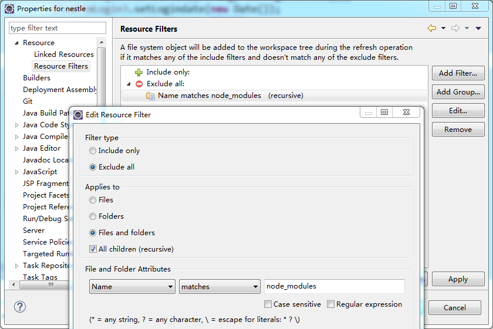

# eclipse 发布war包时忽略某些文件

本公司的一个项目，在微信开发的时候采用的是前后端分离的开发模式，前端采用了前端工程化的方式进行开发，后端采用的是传统的spring MVC作为开发框架。

前端工程化必然会以来大量的npm包，如果不做任何设置，eclipse在生成war包时是会把安装的npm包的文件夹node\_modules添加到war包当中，这回导致生成的war包比较的大，需要对此进行设置。

右击项目名称 MyProject=&gt;Properties=&gt;Resource=&gt;Add Filter..

