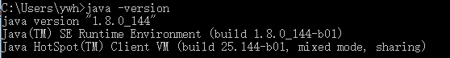
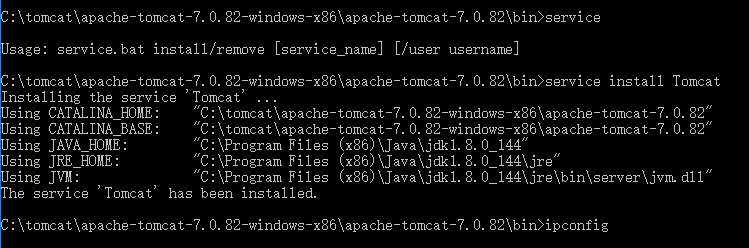
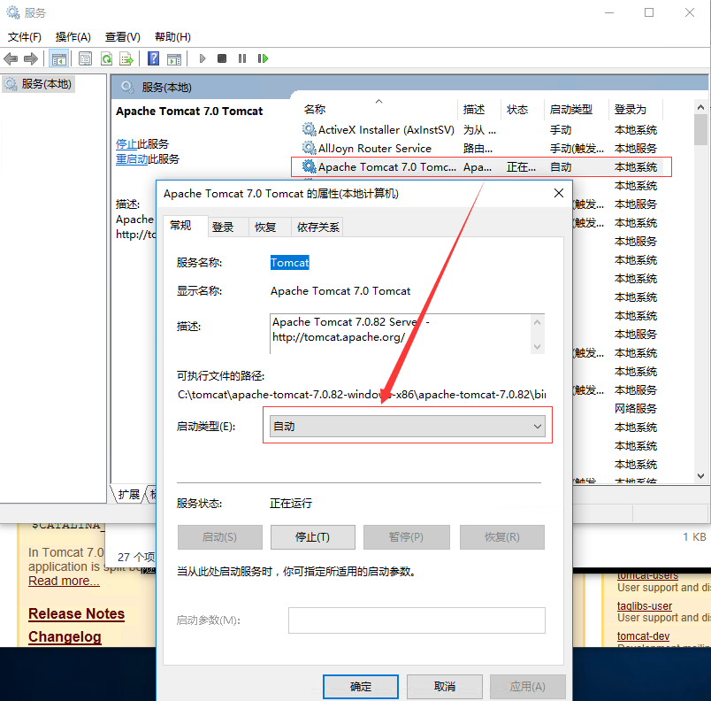

# tomcat winserver 下部署开机自启动

* java环境准备

安装JDK,安装完成后设置系统环境变量，并进行测试是否成功，java安装后需要配置环境变量，主要有这样的几个变量需要配置

| 变量名 | 变量值 |
| :--- | :---: |
| JAVA\_HOME | C:\Program Files\Java\jdk1.8.0\_144 |
| PATH | %JAVA\_HOME%\bin  %JAVA\_HOME%\jre\bin |
| CLASSPATH | .;%JAVA\_HOME%\lib\dt.jar;%JAVA\_HOME%\lib\tools.jar; |

以上配置成功后，我们需要通过命令查看下java环境是否配置成功

* 安装tomcat

我们这里选择的tomcat的版本为7.0.82-&gt;core-&gt;32-bit Windows zip\(pgp,md5,sha1\),注意要使用32为版本，因为64位版本在启动时会发生报错。

tomcat下载解压完成后，我们通过cmd命令进入到tomcat根目录下，执行如下图的操作：

以上操作为将tomcat安装为windows服务，我们还需要设置tomcat开机自动启动设置，具体设置如下：

