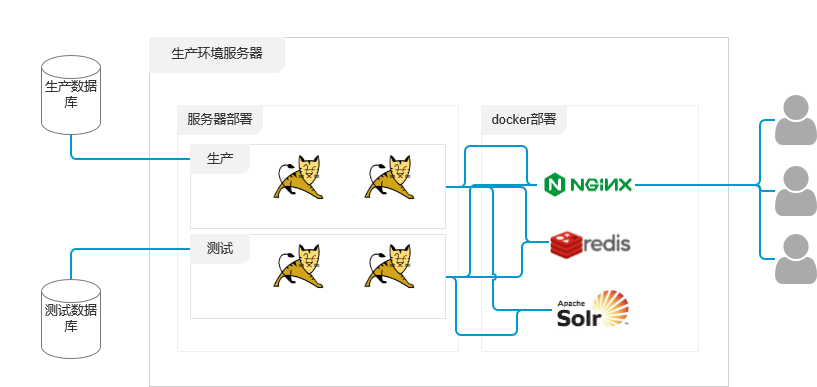

# 一个鲜花电商平台的总结

> 这是我作为项目经理独立主导的一个项目，是一个服务于墓区的鲜花销售APP，为此我再墓区将近睡了有一个多月。

## 表结构设计

再表结构的设计上，我们还是偏向于采用通用电商的表结构设计，该有的字段都设计，可以冗余着先不用，因为你不知道在项目的后期哪些字段会用到，项目后期增加字段会是件比较蛋疼的事情，但是删除字段则比较简单，你完全可以在项目的初期暂时不使用多余的字段。

表结构的设计工具使用的是powerdesign,功能比较的全面，但是市面上还有些其它的表结构设计工具，可能功能简单了，但是基本能满足你的需求，navicat、mysql workbench都是不错的选择。

## 代码风格

* 要取个好名字，所有变量的命名需要通俗易懂，要保持从数据库表明，到controller层路由名的一致，这样追查问题的时候会方便点。
* 写好注释，项目不可能一蹴而就，所以项目写好注释，于己于人都是有好处的，最好的是能够标注注释的类型，有些代码我们不得已采用了一些比较烂的写法实现了功能，我们要在注释中标识FIXME，有些需要后期完善的则需要加上TODO，注释也是有分类的。
* 要习惯写异常处理，尤其是关键的业务，我们更要习惯添加异常处理，通常情况下我们对应数据保存或是更新的业务都需要添加异常处理，数据获取则可以不需要添加异常处理。
* 添加必要的日志输出，我们通常会在代码中保留大量的 `System.out.println()` 代码，这一般来说是不好的习惯，但是如果正发生了什么意外，这些输出对我们来说有是查询异常的重要手段，所以在项目的试运行期间，可以保留这些输出，在项目平稳运行后可以删除这些输出，这些输出日志也会影响系统的运行速度；在系统平稳运行后，我们可以将这些输出保留到try,catch的catch当中，只有在异常发生时我们才会输出这些必要的信息。
* 做一个纯粹的业务代码，我们通常会在业务代码中混合着一些加解密的操作，这些属于非业务代码，属于功能代码，Java是一门面向对象的编程语言，有些功能代码可以放在Java bean 当中，这样可以让业务代码更好的描述业务。
* 是否项目中都是static方法，有些人比较喜欢使用static方法，可能一个项目当中都是 公共静态方法，这么写其实也没什么问题，主要的问题在于在项目启动的时候，静态方法都会申请内存，对内存的占用比较大，一些不怎么长会被使用的方法会一直占据服务器内存。
* 使用存储过程还是sql，存储过程的使用确实是方便了项目，但是对存储过程的管理是个问题。
* 标明日志输出的内容，日志是为了记录，是为了更好的定位问题的所在，一般只会在出问题后才会去找日志，还原当时的情况，所以在日志输出的内容前加上这段内容输出的是什么再好不过了。

## 项目部署

个人喜欢保持服务器的简洁，如果直接将软件安装在服务器上，后期的升级会是个问题，目前最好的解决方案是使用docker,目前服务器部署结构如下：

