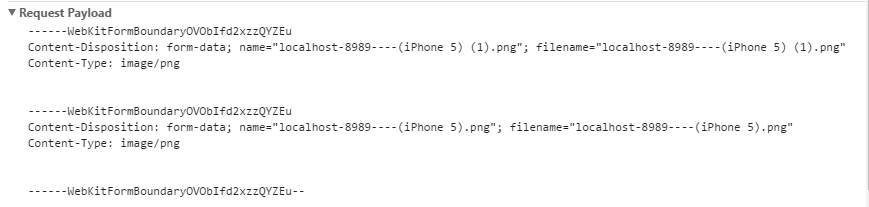

## input文件传输

### 原生的表单提交时怎样的

最近在项目中需要进行图片的提交，主要是通过input标签的 file类型进行提交，那么提交的数据究竟是什么，提交的时候是以什么样的数据格式提交的呢？

下面是一个简单的数据提交的示例：

```html
<!DOCTYPE html>
<html lang="en">

<head>
    <title></title>
    <meta charset="UTF-8">
    <meta name="viewport" content="width=device-width, initial-scale=1">
    <link href="css/style.css" rel="stylesheet">
</head>

<body>
    <input id="test" type="file" multiple name="" value=""><input id="button" type="button" value="提交">
</body>
<script>
    window.onload = function () {
        var input = document.getElementById('test');
        var button = document.getElementById('button');
        button.addEventListener('click', function () {
            console.log('show message!', input.files)
        })
    }

</script>

</html>
```

我们把提交的数据打印出来看看：


结合代码与浏览器中的输出我们进行分析，我们从input DOM对象中获取到file属性，而file属性的值为FileList数组，其中可以看到这里我是上传了2个文件，FileList数组中是2个File对象，我们可以看到，该对象中是一些描述文件的属性，但是并没有看到，文件的具体数据是存储在哪里的。

接下来进行文件的提交，接下来我们进行文件的提交，我们采用fetch的post方式进行提交：

```javascript
submit = () => {
        let {files} = this.state;
        //获取文件对象
        let _file1 = files[2].file;
        let _file2 = files[3].file;
        //实例化一个表单数据对象
        var formData = new FormData();
        formData.append(_file1.name,_file1);
        formData.append(_file2.name,_file2);
        console.log(formData);
        let data = request('/lflweb/springUpload', {
            method: 'post',
            body: formData
        })
    }
```

这里的代码是我在实际的项目中的一段代码，这段代码的前提是我已经取到了input中上传的文件数组，然后包装成FormData对象进行提交，数据被存放在请求的body中，那么我们就在body中看看是什么。



这里上传的是2个图片文件，可以看到通过WebKitFormBoundary（应该是FormData的分隔符）对2个文件的信息进行分割，一次判断文件应该是通过数据流的格式传输到服务端，服务端在依据传递过来的这些文件数据，将文件创建在服务端。

