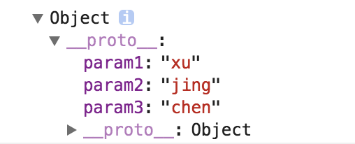

# javascript 创建对象的几种方法

* 使用字面量创建对象

```javascript
        var object0 = {
            name: 'object',
            start: function() {
                console.log('开始了');
            },
            pause: function() {
                console.log('暂停');
            },
            stop: function() {
                console.log('结束');
            },
            _init_: function() {
                this.start();
                this.pause();
                this.stop();
            }
        }
```

可以看到如果使用字面量来创建对象，每创建一个对象就要写这么一大通的代码，还是比较烦的

* 使用Object构造函数来创建一个对象

```javascript
        var object1 = new Object();

        object1.name = 'object1';
        object1.start = function () {
            console.log('start...');
        };
        object1.pause = function () {
            console.log('pause....');
        };
        object1.stop = function () {
            console.log('stop...');
        };
        object1._init_ = function () {
            this.start();
            this.pause();
            this.stop();
        }
```

其实使用字面量与使用Object构造函数来创建对象的区别不是很大，过程相对来说都比较的繁琐，如果创建同一类型的对象的话，需要些一大堆的无用代码。

我们看到可以使用Object构造函数创建对象，创建出来的是一个基本的对象，然后可以在这个对象上面通过赋值之间创建属相，我们能否使用构造函数批量创建出对象呢？

* 构造函数创建对象

```javascript
        function Component(name, start, end) {
            // 通过this来创建属性，这里的函数其实本质也是一个对象
            this.name = name;
            this.start = start;
            this.end = end;
            this.testFu = function() {
                console.log('123');
            };
            this._init_ = function() {
                console.log(this.name);
                console.log(this.start);
                console.log(this.end);
            }
        }

        var object2 = new Component('许静晨', '1992', '~');
        var object4 = new Component('许静晨', '1992', '~');
```

我们可以看到此时我们可以批量的创建对象，通过构造函数的方式创建对象已java通过类创建对象的方式十分的类似。

* 工厂模式创建对象

```javascript
        // 工厂模式创建对象
        function makeObject(name, start, end) {
            var o = new Object();
            o.name = name;
            o.start = start;
            o.end = end;
            o._init_ = function(){
                console.log(o.name);
                console.log(o.start);
                console.log(o.end);
            };
            return o;
        }

        var object3 = makeObject('许静晨', 1992, '~');
```

工厂模式创建对象的本质其实还是通过字面量或是Object构造函数进行对象的创建，但是其通过函数参数接受对象属性值，通过return值返回创建完成的对象，因此可以批量的创建对象。

* 对比区别

我们可以使用对象的constructor来查看各个对象的区别：

```javascript
        console.log(object0.constructor == Object); //true
        console.log(object1.constructor == Object); //true
        console.log(object2.constructor == Object); //false
        console.log(object3.constructor == Object); //true
```

我们可以看到除了用自定义构造函数创建的对象的对象类型不为Object外，其他的对象的类型都为Object。

* 为什么会看到很多的库中的对象的属性都是创造在原型上的？

```javascript
        console.log(object2 == object4);               //false
        console.log(object2 === object4);              //false
        console.log(object2.name == object4.name);     //true
        console.log(object2.name === object4.name);    //true
        console.log(object2.testFu == object4.testFu); //false
        console.log(object2.testFu === object4.testFu);//false
```

我们可以看到如果对象是通过构造函数生成的，那么每个对象都会在一个新的内存地址上创建，其中的testFu属相虽然内容相同，但是确实在不同的内存地址上创建的，这里我们可以声明全局的testFu方法解决此问题，这样可以保证俩个对象的该属性都是引用的同一个内存地址上的此方法。

* 通过原型创建对象

```javascript
        function MakProto() {};
        MakProto.prototype.name = 'name';
        MakProto.prototype.start = 'start...';
        MakProto.prototype.pause = 'pause...';
        MakProto.prototype.number = 1;

        object5 = new MakProto();
        object6 = new MakProto();

        MakProto.prototype.number = 3;
        object6.number = 9;
        MakProto.prototype.number = 10;

        console.log(object5.number);   //10
        console.log(object6.number);   //9
```

通过原型创建的对象会共享所有的属性，但是单个对象属性的修改不会影响到其他的对象。

* 构造函数与原型方式组合创建对象

```javascript
function Mixin(name, start, end){
  this.name = name;
  this.start = start;
  this.end = end;
}

Mixin.prototype = {
  // 我似乎看到了继承的影子
  constructor : Mixin,
  testFu : function(){
    alert(this.name);
  }
}
```

通过此方式很好的结合构造函数和原型模式，这与java类的思想有点类型，其中放在原型中的属性可以看做是静态属性或是静态方法，是共享的。\(这种创建对象是最常见的\)

* 使用clone方法创建对象

在javascript这样的基于原型设计的语言中，几乎所有的对象都是基于对象复制与克隆产生的，所以我们创建一个对象的时候也可以使用clone的方法，javascript中可以使用Object.create 方法来创建对象。

```javascript
        var test1 = {
            param1: 'xu',
            param2: 'jing',
            param3: 'chen'
        }

        var test2 = Object.create(test1);

        console.dir(test2);
        console.log(test2.param3);
        // test2.param3 = 'dandan';
        console.dir(test1);
        console.log(test1.param3);
        console.dir(test2);
        console.log(test2.param3);
```



以上代码就是通过Object.create 方法来创建对象，通过打印对象，我们会发现test2 的原型是指向 test1，在test2中没有发现新的属性，也就是说test2中所有的属性都是test1当中的，这里实现的方式是通过创建一个空对象，然后将该对象的原型指向test1，从而实现对象的克隆。

其实这里与通过字面量创建对象的方式类似，我们可以看到创建的对象的原型指向的是object这个对象，那么object的原型指向谁呢？指向的是null。

