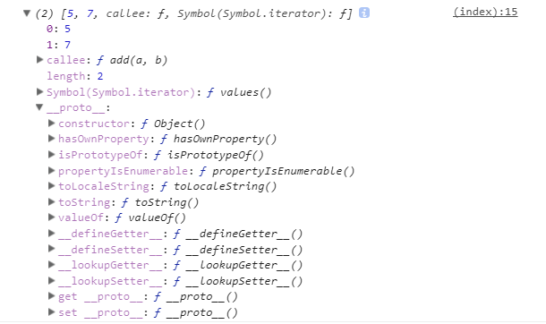
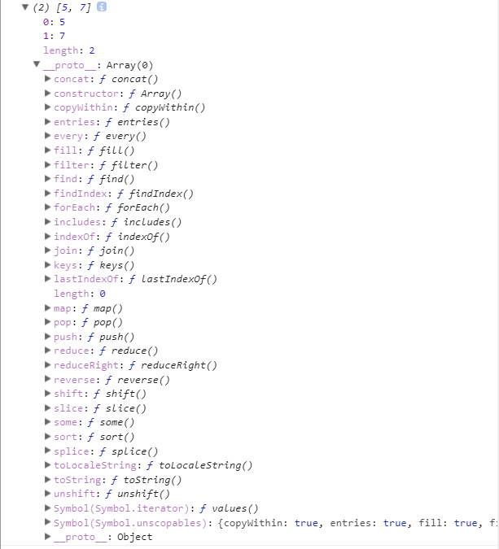
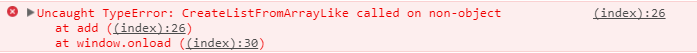

# javascript 的call和apply

* 起因

我们知道arguments对象是函数中的参数对象，他很像一个数组，但是他并不是一个数组，在javascript中有很多这样的问题，我们可以看到下图中的函数参数数组和平常的数组类型是不相同的。

```javascript
        function add(a, b) {
            console.log(arguments);
        }
        add(5, 7);
        var test = [5, 7];
        console.log(test)
```





通过上面的对比我们可以明显的看到两个对象存在的不同，我们可以看到函数参数数组中是没有一些常用的数组操作方法的，那么如果我们想对函数参数数组进行普通数组的操作怎么办，举个例子，我们需要使用到slice方法：

```javascript
    window.onload = function(){
        function returnArg() {
            return arguments;
        }

        function add(a, b) {
            console.log(arguments);
            var slice = Array.prototype.slice;
            var defaultArray = slice.call(arguments, 1);
            console.log(defaultArray);
            console.log(defaultArray.slice());
            // apply 会自动的将第二个参数（必须是数组、伪数组）转化为调用函数的参数对象（arguments）
            console.log(returnArg.apply(this, defaultArray));
            console.log(returnArg.apply(this, 123));
            console.log(returnArg());
            console.log(returnArg(defaultArray));

        }
        add(5, 7);
        var test = [5, 7];
        console.log(test);
```

以上代码中需要注意apply的第二个参数必须为数组或是伪数组，不然则会出现以下的报错：



call的用法：A对象拥有b方法，C对象想使用b方法，A.prototype.b.call\(C\),这里是以C对象替换A对象的位置，所以C对象就拥有了b方法。

apply的用法：apply的用法与call类似，需要注意的是apply的第二个参数为数组或是伪数组。

* 相关文章
* [apply与call的区别](https://www.cnblogs.com/lengyuehuahun/p/5643625.html)

