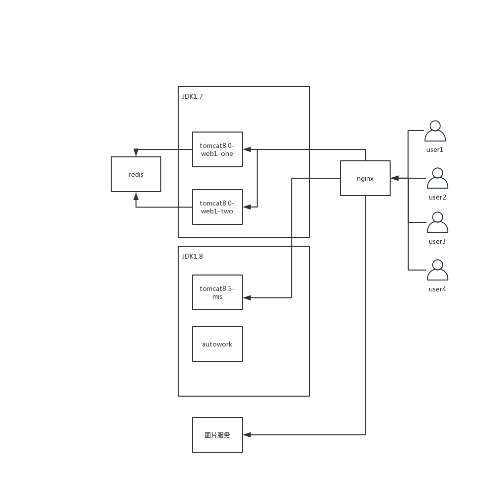

# 电商项目三年回顾

> 虽说这个电商项目不是全程参与的，中间有段时间参加到公司的其他项目当中，但是最后当初的项目经理走了，项目最后竟然落到我的手里，一坨坨陈年代码浮现在我的眼前。

## 项目架构

### 部署简介

项目整理部署在一个服务器上，对外只通过NGINX暴露80、443端口，通过NGINX将请求你转发到对应的应用上，用于历史原因服务器上原本安装的jdk版本为1.7，我在接收后为了保证项目商城主要业务的稳定，这部分的部署方式不做调整，依旧通过Redis存储session，保障2台web服务器session一致。

在不影响原有系统运行的情况下，服务器全局JDK版本不变，对于商城的后台管理系统无需使用负载均衡，所以将后台管理系统单独部署，重新部署tomcat，该tomcat指定JDK为1.8，对外的系统访问地址不变，通过NGINX配置的调整，将请求转发到新的tomcat端口。

项目中存在定时任务需要执行，一些自动化的任务通过autowork项目执行，负载均衡需要解决的定时任务重复执行的问题通过autowork解决。

使用NGINX作为图片服务器，所有图片上传到指定文件夹，通过NGINX提供一个图片的web服务。

## 关于表结构相关

三年之中出现了大概有三次的生产环境事故，这三次事故都是数据库服务器CPU异常，应用服务器的异常倒是比较少，代码虽然丑，但是也只是有些内存溢出，基于运维到目前的运维问题，总结了一下几点：

* 每张表尽可能的设置唯一主键，如果不能设置唯一主键，那就设置联合主键，对于像在用户表中的手机号码，微信openid之类的必然唯一的数据，设置唯一索引；
* 如果是电商项目还是减少存储过程的使用吧！关于存储过程的维护会是个很大的问题，尽可能的通过在mybatis中编写SQL语句实现；
* 针对于SpringMVC的电商项目，每个DAO方法都应该是单一职能的，尽量保证一个功能复杂的DAO方法（修改多个字段数据的DAO方法）只被一处引用，如果只修改一个字段的数据，则需要取一个好的DAO方法名称；
* 一定要设置连接池的大小，三次生产环境的数据库服务器CPU异常，其实都是数据库连接过多导致的；
* 注意事务的使用，查询是不需要使用事务的，事务是为了使数据的一致性得到保证，在对多个数据表进行数据操作时，为了保证数据的一致性需要使用事务，事务的使用会导致数据库服务器CPU上升。

## 关于生产环境的测试

生产环境的测试是一个大问题，现在有很多的手段来保证生产环境与开发环境的一致性，但是我们还是会在很多时候听到这样的话“我本地是好的”，但是生产环境都是正式数据，务必要十分小心，关于生产环境的测试应该从项目的开发之初就应该考虑到的问题。

* 测试环境与正式环境的一致性问题，很多问题存在于特定的环境之下， 目前的做法是在生产环境上部署一套测试环境；
* 设置特殊的账号用于测试，有些关于支付的设置只在生产环境才有；
* 关于项目全局变量的配置，目前看到的最好的解决方案是springboot的解决方案，各个环境的配置变量写在各个文件中就可以了。

