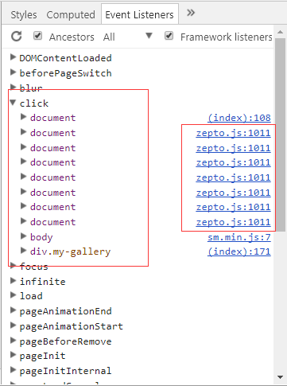

# js框架间的爱恨情仇

date: 2018-01-25

* 前言

> 注意是js框架与框架之间，而不是框架与我之间，比如jquery与zepto之间关于$的争夺，bootstrap演示与插件样式之间的冲突，还有就是今天遇到的不同框架对同一元素的事件监听。

* 农历腊月初九 大雪 宜祭祀 忌嫁娶

年关将至，心情也似这地面积雪般厚重，一旦春节过后，我们不可避免的面对2017年彻底过去了，而我也27岁了，离而立之年只剩三年。

同事在使用[SUI](http://m.sui.taobao.org/)集成[PhotoSwipe](https://github.com/dimsemenov/PhotoSwipe)时遇到了问题，点击缩略图片无法跳转至图片详情页，而是直接跳转到单个图片的显示页面，于是我开始寻找问题出在哪里，在没有集成到[SUI](http://m.sui.taobao.org/)框架中时是好的，集成了就出现问题，所以干脆正确的和错误的一起调试看看是什么鬼，果然这调试就看出不同来了，事件监听函数不同，zepto中的事件监听函数取代了[PhotoSwipe](https://github.com/dimsemenov/PhotoSwipe)框架中的事件监听函数，这里zepto不是主动添加监听的是，[SUI](http://m.sui.taobao.org/)用zepto给页面中的元素添加了事件监听，所以打开调试工具，我看到了一串的事件监听，如下图：

我们看到[SUI](http://m.sui.taobao.org/)利用zepto添加了较多的事件监听，我通过remove测试了一下，只要移除第二个监听就没有问题了，所以我打算移除第二个监听，但是问题是如果监听的函数是匿名函数，你是没法移除监听的，问题陷入绝境，通过正常手段是不能解决这个问题了，只能改zepto这个文件了，在这里修改了其添加事件监听部分的代码，通过过滤掉对a标签添加事件监听，果然成了，问题历时半天。

窗外的雪还在下着，看起来有越下越大之势。

