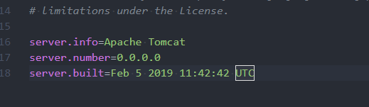

# maven 打包本地依赖

> 首先要吐槽下，用百度查找编程资料是个错误的选择，基本通过百度来解决一些项目配置问题时，通常会接收到海量的无用信息，你需要在这些无用的信息中不断的筛选，做出自己的判断，不断的尝试，才能发现解决方案，个人发现了导致这种现象的原因。
>
> * 国内的分享意识不是很强烈，大家都非常的忙，存在着各种各样的压力，我看到很多人的博客就是几行字，估计这个博客只有作者自己能看得懂，相对而言，在github和Stack Overflow上的用户就相对来说会更加的热情一点，基本上在上面能很快的找到答案。
> * 国内的编程社区基本都是在做流量，没有关心内容的，当然个人觉得掘金算是做的比较好的，其他的平台，充斥着大量的爬虫抓取，人工复制粘贴的文章，导致你百度的时候发现列表第一页的连接中的文章竟然是一样的，只不过来自不同的网站。

### maven添加本地依赖

```bash
install:install-file   
-Dfile=E:\workspace\smoparkworkspace\smopark\lib\artemis-http-client-1.2-SNAPSHOT.jar  
-DgroupId=artemis-http-client  
-DartifactId=artemis-http-client  
-Dversion=1.2  
-Dpackaging=jar
```

现在我们通过idea创建一个本地库，这是海康威视的一个依赖jar包，以上设置完成后：



以上执行完成后，可以看到本地仓库中已经有该jar包了，接下来，我们需要将该依赖添加到POM当中：

```markup
	  <!-- 海康威视SDK -->
	  <dependency>
		  <groupId>artemis-http-client</groupId>
		  <artifactId>artemis-http-client</artifactId>
		  <version>1.2</version>
		  <scope>system</scope>
		  <systemPath>${project.basedir}/lib/artemis-http-client-1.2-SNAPSHOT.jar</systemPath>
	  </dependency>
```

下面需要注意的是在maven进行打包时，需要将该jar包打包到最终的war包当中，则需要对打包插件 maven-war-plugin 进行设置，具体的配置参考如下：

```markup
      <plugin>
        <groupId>org.apache.maven.plugins</groupId>
        <artifactId>maven-war-plugin</artifactId>
        <version>2.2</version>
        <configuration>
          <webXml>WebContent\WEB-INF\web.xml</webXml>
          <warSourceDirectory>WebContent</warSourceDirectory>
			<webResources>
				<resource>
					<directory>lib</directory>
					<targetPath>WEB-INF/lib</targetPath>
					<includes>
						<include>**/*.*</include>
					</includes>
				</resource>
			</webResources>
        </configuration>
      </plugin>
```

