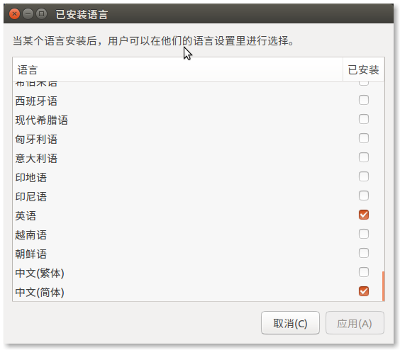

## Ubuntu 服务器环境准备

电脑的内存加到16G,感觉自己如果是不折腾下的话，都有点浪费了，看了一下，在我正常使用的情况下，内存才使用了25%，于是显示做了个内存盘，然后在虚拟机里面跑了个Ubuntu，感觉还不赖，无论是主机win10还是客户几Ubuntu都没有卡顿。

1、Ubuntu虚拟机中安装完成后，可能屏幕很小？

你需要：右上角 系统设置->显示->将屏幕分辨率调整到最大。


以上工作完成后，在虚拟机顶部的工具栏中选择查看->立即适应客户机，则屏幕的尺寸则会随着主机的大小改变而改变。

2、设置系统文字为中文

你需要： 右上角 systemsetting->languagesupport->addordeletelanguage

点击该按钮后如下图：



选择对应的语言并下载，最后在语言的设置页通过鼠标拖动，将中文简体拖动到第一行，确认保存后，系统语言则设置为了中文。

3、配置node开发环境

node 的配置请参考文档1，通过nvm安装node是比较好的选择，不同版本的node之间的切换非常的方便，更好的使用nvm可使用nvm的help命令，该文虽然很久就已经写了，但是在2017-03-23在Ubuntu16.04的环境下实验是没有问题的。

4、Java开发环境的配置

Java开发环境的配置请参考文档2，其中需要注意的是你可能需要安装一下vim软件，如果你没有安装过的话，你可执行一下vim命令，如果没有安装该软件，则会提示安装该软件的命令，按照该命令安装即可。

其中几个可能会用到的vim命令如下：

打开文件： ````vim [filename]````
插入内容： ````a````
保存修改： ````Esc->Ctrl+:->wq````
放弃修改： ````Esc->Ctrl+:->q！````

5、安装MySQL请参考文档3，

安装过程中需要注意的主要有，在


### 参考文档

[1][ubuntu下nvm,node以及npm的安装与使用](http://blog.csdn.net/minchina91/article/details/40260263)<br/>
[2][Ubuntu 16.04配置Java开发环境](http://www.cnblogs.com/deitymon/p/5926619.html)<br/>
[3][Ubuntu下安装MySQL及简单操作](http://www.linuxidc.com/Linux/2016-07/133128.htm)<br/>
[4][ 解决Navicat无法连接到MySQL的问题](http://blog.csdn.net/mtbaby/article/details/56836986)<br/>
[5][ MySQL添加用户、删除用户与授权](http://www.cnblogs.com/wanghetao/p/3806888.html)
