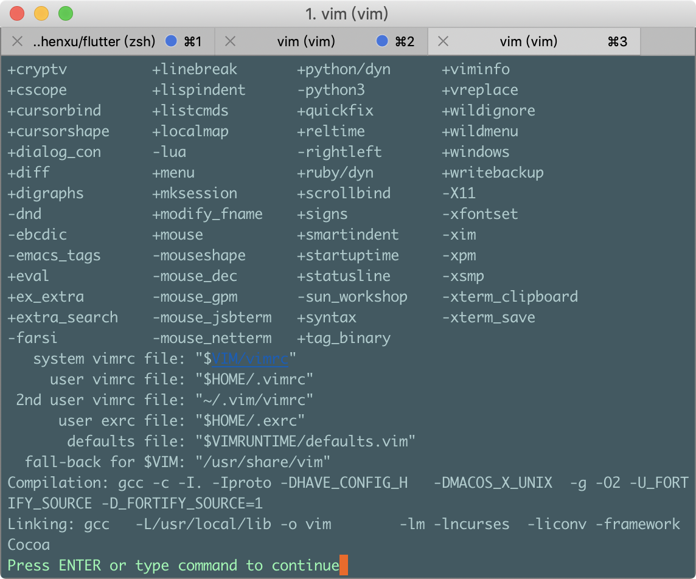

# vim 使用配置

## 找到vim配置文件的位置

了解你的vim，在命令行中输入vim命令，在vim当中查看vim的版本信息：

```bash
    ：version
```



以上就是我们看到的vim相关信息，其中我们需要关注的是 user vimrc file: 这个选项，这个选项告诉我当前的vim的配置文件所在的位置，一般来说访问的位置为 ～/.vimrc，在vim中可以通过 :e ~/.vimrc 命令打开。

## vim常用的一些配置


