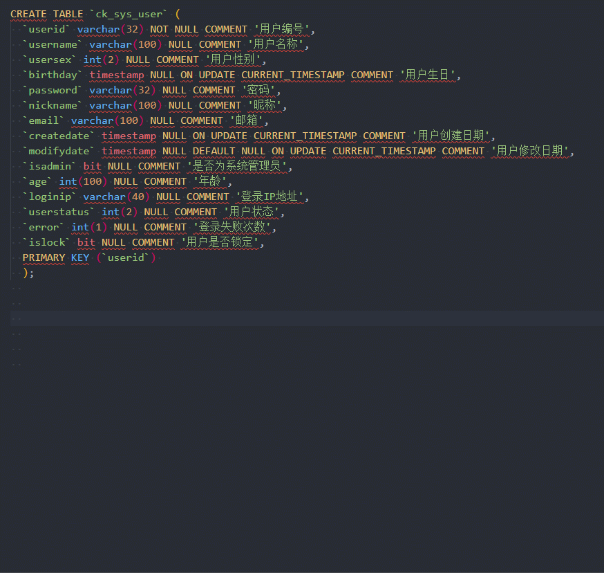

# vscode 加速crud

> 工作中常常存在一些重复的工作，代码编写中也是如此，对于重复的代码我们要保证风格一致还要保证排版美观，通过单纯而粗暴的复制粘贴并不能达到上面的2个效果，本文将通过3种方式进一步简化重复的代码编写工作，作者主要的编辑器为vscode和idea。

## 快捷键

### 列选择及插入

传统的管理系统类项目更多的代码是围绕数据库展开的，不管是前端json还是后端的javabean，我们可以看到很多的代码都是围绕数据库表展开的，对于这写最常见的代码，我们该如何加速编写呢？首先分析一个javabean的产生流程：

1. 设计表结构；
2. 获取表结构字段；
3. 通过表结构字段生成相应的代码。

表结构的设计可以通过navicat、powerdesign之类的软件进行设计，下面我通过navicat设计一张用户表如下\(用户表\)：

获取表结构字段，navicat中通过复制可获得表创建SQL语句，通过对表创建SQL语句的操作，可以获得想要的关键字段\(1. 按住 Alt + 左键 拖放光标 -&gt; Ctrl + d 选中单词 2. 按住 Alt+左键 拖放光标 按住向上键到指定位置可批量编写代码 \)：

以上可以看到非常快速的就生成了代码，当然在idea软件中有更加快捷的操作

## 代码片段（snippet）

目前我司的前端框架基本稳定，很多常用的组件或者模板都已编写好，很多时候一个项目中最大的工作可能是复制粘贴，对于比较重复的代码，我们可以使用大多数编辑器都有snippet功能，下面介绍下vscode的snippet功能。

点击左下角设置按钮，选择用户代码片段菜单，找到你要针对哪一类的文件编写snippet，我选择vue-html，这些代码主要是一些UI组件的代码，复制粘贴比较烦，一种比较常见的情况是，在使用iview组件库的时候，对于form表单下的组件编写起来比较麻烦，我们可以添加如下的代码片段：

