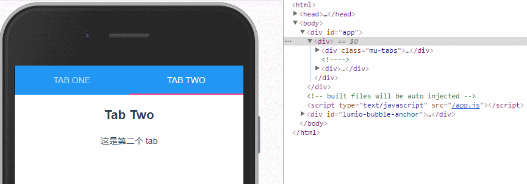

## VUE 学习笔记

Mark一下，反正我从来不管自己挖了多少坑，哟呵呵，vue去掉可恶的#好简单。

### 遇到的问题

通过iView cli生成的项目中，如果style使用了less,而且在less的编写过程中使用了less的嵌套特性，那么样式是无效的，但是通过查看main.css又可以查看到该样式；

个人感觉在VUE中一个比较屌的就是数据的双向绑定，但是也有不喜欢，但是我喜欢，但是国内的不少中文教程中关于v-model的用法介绍中，data的写法还是用的json对象的写法，而最新版本的写法采用的是函数式的写法，这里要注意一下；

v-if and v-show 在学习VUE的过程中发现了VUE本身提供了较多的v的专属命令，解决了很多开发过程种出现的共性问题，这一点确实比react好了不少，react的受控组件相当的蛋疼。好说说看今天的v-if 和 v-show，v-if:根据v-if关联定的判断值，从而进行页面元素的delete 和 append，涉及到了DOM操作，对性能会有一定的影响；v-show通过css控制页面元素的显隐性，无DOM操作，页面数据保留，俩者都有各自的适用场景。

### 动手撸个VUE组件吧

工作中的项目主要使用的是react，关于组件，我认为有以下几点比较重要：
1、父组件向子组件传值；
2、子组件向父组件通信；
3、组件自身方法及状态维护；
那么我们就围绕以上三点开始撸一个VUE组件，

