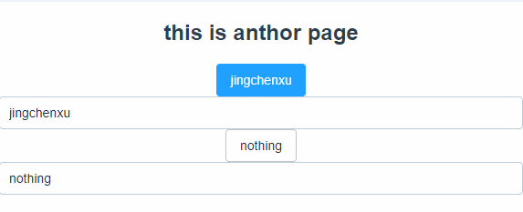

# vue中的数据双向绑定

* v-model指令

在前端涉及到表单提交的地方很多，vue\react之类的框架中，已经屏蔽了dom操作，页面中的数据都会保存在对象当中，因而如何实现视图数据与对象数据的同步成了一个问题，react中提出了受控组件这样的概念，就是input中的值是通过js来设置的，通过监听事件，来设置值，并同时设置组件状态中的值。

vue中通过v-model指令来实现，组件状态与页面数据的同步，如果只是简单的需要将页面展示与组件状态进行同步，查看下面的代码：

* A

  ```markup
  <el-button v-on:click='showname' type="primary">{{myname}}</el-button>
    <el-input v-model='placeholder' placeholder='placeholder'></el-input>
  ```

* B

  ```markup
    <el-button>{{saysomething}}</el-button>
    <el-input v-model='saysomething' placeholder='placeholder'></el-input>
  ```

```text
    data () {
      return {
        myname: 'jingchenxu',
        saysomething: 'nothing'
      }
    },
    // 此处会实现数据的双向绑定
    computed: {
      placeholder: {
        get: function () {
          let newname = this.myname
          return newname
        },
        set: function (value) {
          value = value.toUpperCase()
          this.myname = value
        }
      }
    },
```



我们可以看到A代码，可以将将页面与函数进行数据的双向绑定，在其中可以添加一些操作，比如本文代码中的将字母的小写转为大写，而B代码这是简单的数据绑定，将页面数据与组件状态进行了绑定，可根据实际情况选择对应的绑定方式。

* 相关文章
* [剖析Vue原理&实现双向绑定MVVM](https://segmentfault.com/a/1190000006599500)

