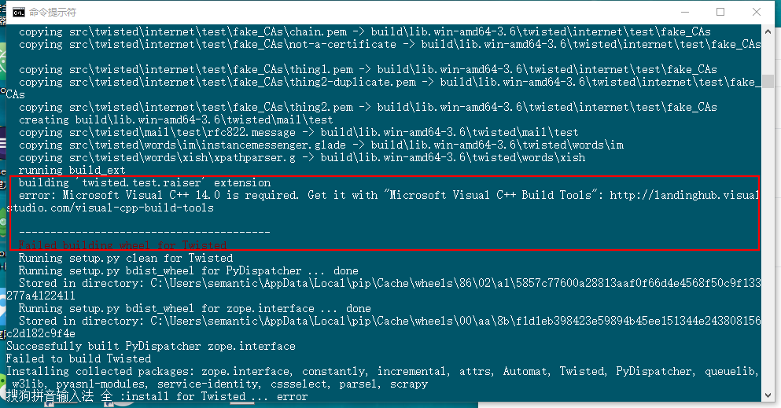

# Windows 下scrapy 环境搭建小记

1、安装python，我安装的是最新的3.6版本；

2、安装pip,但是安装完了不能直接使用，使用pip进行安装的话会出现如下的问题（windows 下和 linux 下的使用模式是不一样的，故而使用一下命令）： `Fatal error in launcher: Unable to create process using '"'` 于是暂时使用这个命令进行包的安装`python -m pip install scrapy`

3、安装scrapy时出现如下的报错  个人不建议安装 Microsoft Visual C++ Build Tools,因为其体积比较大，后来在网上找到的办法是手动安装`Twisted-17.1.0-cp36-cp36m-win_amd64.whl`文件即可，`python -m pip install Twisted-17.1.0-cp36-cp36m-win_amd64.whl`,注意在文件所在的目录执行该命令，此外还需要注意需下载对应版本的文件。

4、代码格式化工具安装： `python -m pip install autopep8`

5、scrapy 安装完成后，

6、常用的命令：

项目运行命令：`scrapy crawl foxebook`

抓取结果生成json: `scrapy crawl foxebook -o items.json`

